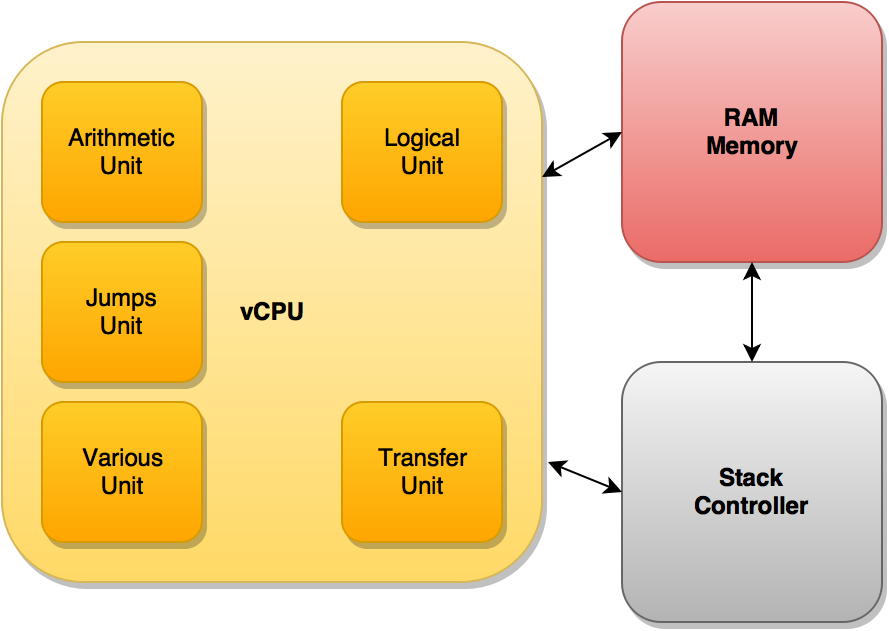

# Haxor VM
Haxor consists of compiler _hcc_, linker _hld_ and virtual machine _hvm_.
_hcc_ translates asm-like code into tokens, _hld_ links them into bytecode, while _hvm_ runs it.

## Man, why have you written that?
Writing own implementation of VM gives a lot of knowledge about
computer's architecture. You hit into issues not known during day
by day activity in high level languages you use. So... just to
broaden horizons and for fun ;)

## Usage
Compilation:
```
hcc program.hax
```

Linking:
```
hld -o program.hax.e program.hax.u
hld -s 4096 -o program.hax.e program.hax.u # custom stack size
```

Run:
```
hvm program.hax.e
```

## License
Haxor is licensed under BSD 3-clause license. You can read it [here](LICENSE.txt).

## Architecture



### General information
* Little Endian
* Size of WORD is 64 bit
* All registers are 64 bit
* All numbers are signed
* Memory works in flat model
* Only integer arithmetic is supported
* All memory cells are writable

### OpCodes
OpCode is 64 bit integer. 0-7 bits are used to designate command, 8-63 are used to specify flags.
Command can take 0, 1 or 2 operands. All operands are 64 bit addresses in memory. Const values
are pushed into _.data_ section by compiler and pointed by automatically generated labels.

```
[opcode (command + flags)] [operand1] [operand2]
```

### vCPU
vCPU registers are mapped into lowest memory addresses between 0 and 1024 bytes.
* _ip_ - instruction pointer
* _sp_ - stack pointer
* _bp_ - base pointer
* _ar_ - arithmetic register I
* _dr_ - arithmetic register II
* _fr_ - flags register
* _sc_ - syscall register
* _op_ - currently processed opcode
* _r01-10_ - general usage registres

### Flags register
Flags register is 64 bit.
* bit 0 - ZERO (`A-B=0`, so numbers are equal)
* bit 1 - SIGN (result is negative)
* rest is reserved for future use

## Memory map


## Language
Haxor uses primitive asm-like syntax. Each command goes into separate line.
You can add comments in code, but they also need to be separate lines, beginning
from _#_ or _rem_.
For two-argument commands destination goes into first argument while source into second one.
In some commands you can dereference value by enclosing it in brackets (e.g. `[sp]`).
Program starts from _main_ label.

```
command A, B
```

## Instructions
### Arithmetic
#### add
Sums _A_ and _B_, result goes to _A_.
_A_ or/and _B_ can be dereferenced.
OpCode: 0x01.
```
add A, B
```

#### sub
Subtracts _B_ from _A_, result goes to _A_.
_A_ or/and _B_ can be dereferenced.
OpCode: 0x02.
```
sub A, B
```

#### div
Divides `ar` register by _A_. Result goes to register. Remainder goes to `dr` register.
_A_ can be dereferenced.
OpCode: 0x03.
```
div A
```

#### mul
Multiplies `ar` register by _A_. Result goes to register.
_A_ can be dereferenced.
OpCode: 0x04.
```
mul A
```

#### inc
Increments _A_ by 1.
_A_ can be dereferenced.
OpCode: 0x05.
```
inc A
```

#### dec
Decrements _A_ by 1.
_A_ can be dereferenced.
OpCode: 0x06.
```
dec A
```

#### cmp
Compares _A_ with _B_ by subtracting _B_ from _A_ and setting flags register bits.
_A_ or/and _B_ can be dereferenced.
OpCode: 0x07.
```
cmp A, B
```

### Logical
#### and
Performs bitwise AND operation.
_A_ or/and _B_ can be dereferenced.
OpCode: 0x40.
```
and A, B
```

#### neg
Reverses the sign of number _A_.
_A_ can be dereferenced.
OpCode: 0x41.
```
neg A
```

#### not
Performs bitwise NOT operation.
_A_ can be dereferenced.
OpCode: 0x42.
```
not A
```

#### or
Performs bitwise OR operation.
_A_ or/and _B_ can be dereferenced.
OpCode: 0x43.
```
or A, B
```

#### xor
Performs bitwise XOR operation.
_A_ or/and _B_ can be dereferenced.
OpCode: 0x44.
```
xor A, B
```

### Transfer
#### mov
Moves data from _B_ to _A_.
_A_ or/and _B_ can be dereferenced.
OpCode: 0x60.
```
mov A, B
```

#### push
Places _A_ on top of stack.
OpCode: 0x61.
```
push A
```

#### pop
Removes element from top of the stack and into _A_.
OpCode: 0x62.
```
pop A
```

### Jumps
#### call
Places _ip_ register on the stack and jumps to _A_.
_A_ can be dereferenced.
OpCode: 0x20.
```
call A
```

#### ret
Pops _ip_ from the stack, and jumps to it.
OpCode: 0x2c.
```
ret
```

### iret
Comes back from interrupt.
OpCode: 0x2d.
```
iret
```

#### jmp
Performs unconditional jump to _A_.
_A_ can be dereferenced.
OpCode: 0x21.
```
jmp A
```

#### je
Jumps to _A_ if in _cmp_ _A_ is equal to _B_.
_A_ can be dereferenced.
OpCode: 0x22.
```
je A
```

#### jg
Jumps to _A_ if in _cmp_ _A_ is greater than _B_.
_A_ can be dereferenced.
OpCode: 0x23.
```
jg A
```

#### jge
Jumps to _A_ if in _cmp_ _A_ is greater or equal to _B_.
_A_ can be dereferenced.
OpCode: 0x24.
```
jge A
```

#### jl
Jumps to _A_ if in _cmp_ _A_ is less than _B_.
_A_ can be dereferenced.
OpCode: 0x25.
```
jl A
```

#### jle
Jumps to _A_ if in _cmp_ _A_ is less or equal to _B_.
_A_ can be dereferenced.
OpCode: 0x26.
```
jle A
```

#### jne
Jumps to _A_ if in _cmp_ _A_ is not equal to _B_.
_A_ can be dereferenced.
OpCode: 0x27.
```
jne A
```

#### jng
Jumps to _A_ if in _cmp_ _A_ is not greater than _B_.
_A_ can be dereferenced.
OpCode: 0x28.
```
jng A
```

#### jnge
Jumps to _A_ if in _cmp_ _A_ is not greater or equal to _B_.
_A_ can be dereferenced.
OpCode: 0x29.
```
jnge A
```

#### jnl
Jumps to _A_ if in _cmp_ _A_ is not less than _B_.
_A_ can be dereferenced.
OpCode: 0x2a.
```
jnl A
```

#### jnle
Jumps to _A_ if in _cmp_ _A_ is not less or equal to _B_.
_A_ can be dereferenced.
OpCode: 0x2b.
```
jnle A
```

### Various
#### lea
Pushes address of _B_ into _A_.
OpCode: 0x80.
```
lea A, B
```

#### nop
Does nothing.
OpCode: 0x81.
```
nop
```

#### int
Generate software interrupt with ID specified by _A_.
_A_ can be dereferenced.
OpCode: 0x85.
```
int A
```

#### syscall
Asks Haxor VM to do "system" call. OpCode: 0x86.
```
syscall
```

## System calls
Using _syscall_ command you can run some system calls provided by Haxor VM.
System call number is passed via _sc_ register, arguments go via stack in reversed order.

### exit (01h)
Terminates VM process with specified exit code.
Takes 1 argument:
* exit code
```
push 100
mov sc, 01h
syscall
```

### printf (02h)
Prints formatted text into file specified by descriptor.
Takes 2 or more arguments:
* file descriptor (1 for standard output, 2 for standard error)
* format string
* data depending on format string...
```
lea r01, format_text
push r01
push 1
mov sc, 02h
```

### scanf (03h)
Converts data from file specified by descriptor.
Remember that memory is not automatically
allocated by this function. You need to prepare
space before calling this function.
Use length limits to avoid buffer overflow (e.g. %100s to take up to 100 characters from string).
In case of string your buffer must have 1 element more for closing '0'.
Takes 2 or more arguments:
* file descriptor (0 for standard input)
* format string
* addresses in memory to put data into them...
```
section .data
dw scanfmt, "%100s", 0

section .bss
label name
resw 101

lea r01, name
push r01
lea r01, scanfmt
push r01
push 0
mov sc, 03h
syscall
```

### random (04h)
Generates random integer from specified range.
Arguments:
* minimum (inclusive)
* maximum (inclusive)
Generated number is pushed onto stack.
```
mov sc, 04h
push 100
push 1
syscall
```
